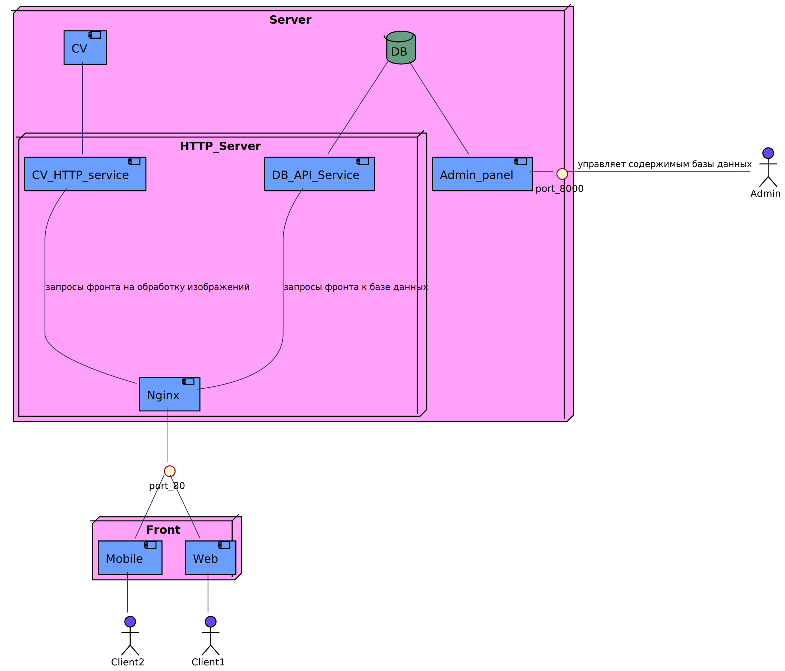

# How to install

---

### Preparations

Install Docker and Docker compose

---

## How to run docker-compose

1. Create .env file in docker-compose directory (or rename .env.example)
2. Fill .env file with the following variables:
   - `DB_NAME` = name of the database
   - `DB_USER` = name of db user
   - `DB_PASSWORD` = db password
   - `DB_PORT` = port of db
3. Run `docker compose up` in the backend repository folder

# Service architecture

